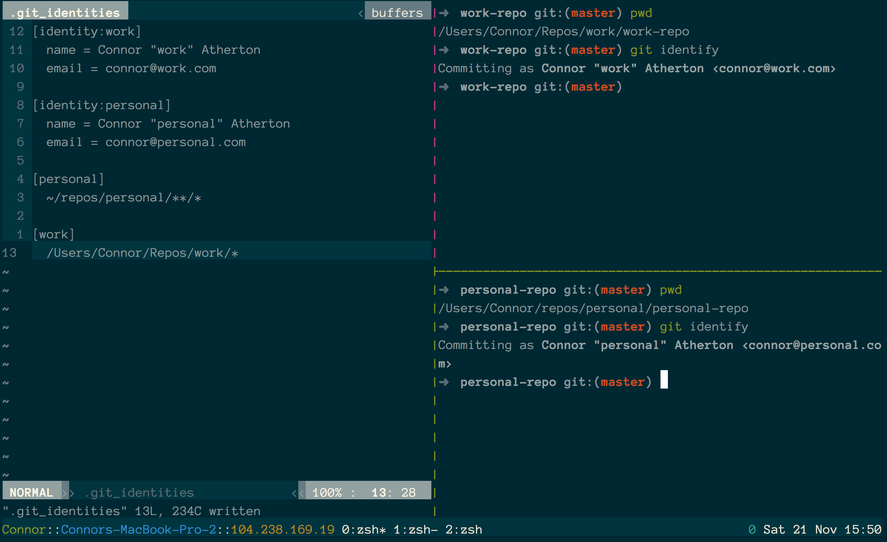

# git-identify 



tl;dr Adds a `git identify` command to set the current repo's config to a pre-configured identity.

Easily configure different git identities on the same machine.

Have you ever added a one line change to a repository and only realized
after pushing that you've added the commit with the wrong name and email?
Yeah - me too.

`git-identify` tries to solve that problem by declaring identities and
their mappings in one place - a `~/.git_identities` file.

### To install

Pull down the git-identify  repository. Then, add the `git-identify` file to your
$PATH. I've symlinked it into `usr/local` in the example below but copying will also
work.

```shell
git clone https://github.com/ConnorAtherton/git-identify.git && cd git-identify
ln -fs $(pwd)/bin/git-identify /usr/local/bin/git-identify
```

### Running

To start, create a `~/.git_identities` file that follows the example below.
The syntax tries to follow the `.git/config` style where possible.

```
[identity:work]
  name = Connor Atherton
  email = connor@work.com

[identity:personal]
  name = Connor Atherton
  email = connor@personal.com

[personal]
  ~/repos/ideas/*
  /Users/Connor/repos/personal/*

[work]
  /Users/Connor/repos/work/*
```

A few key points:
- Whitespace is not significant and is stripped out
- Identity declaration order doesn't matter
- The first match always wins
- The globs are case-insensitive (mainly because I use zsh)

Enter into a repo and run `git identify` to modify the local git
configuration according to the matching identity in the `.git_identities` file..

Check your config in the target repo to make sure the identity rules are correct.

```shell
cd ~/repo
git identify
git config -l
```

Search for the last occurence of the `user.name` and `user.email` fields.

### Running the tests

We use [BATS](https://github.com/sstephenson/bats) for testing. To test, run
`bats tests/*.bats` from the root of this repo and it will print out the test
results.

### FAQs

**How is this better/worse than setting git config manually**

It stops you from forgetting to do that as long as you get into the habit of running git identity.

### Similar projects

- [karn](https://github.com/prydonius/karn) Adds it's own `git` function into the shell. Is completely automatic.
- [gas](https://github.com/walle/gas)
